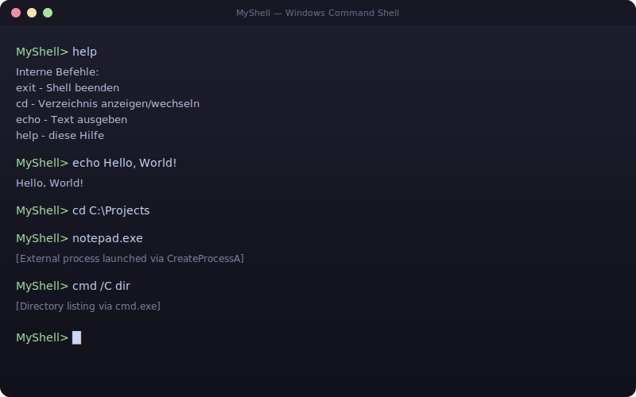

# MyShell — Windows Command Line Shell

A custom command-line shell for Windows, written in C++17. Implements built-in commands and process execution via the Win32 API.



## Features

- **Built-in commands**: `help`, `cd`, `echo`, `exit`
- **External program execution** via Win32 `CreateProcessA` API
- **Command tokenization** with quoted-argument support (e.g. `"C:\Path With Spaces\file.txt"`)
- **Process synchronization** with `WaitForSingleObject` and proper handle cleanup
- **Error handling** for invalid commands and failed process launches

## Tech Stack

- **Language**: C++17
- **Platform**: Windows (uses Win32 API)
- **Build**: CMake 3.15+

## Project Structure

```
Shell/
├── CMakeLists.txt          # Build configuration
├── README.md
├── LICENSE
├── docs/
│   └── screenshot.svg
├── include/
│   └── shell.h             # Shell class interface
└── src/
    ├── main.cpp            # Entry point
    └── shell.cpp           # Shell implementation
```

## Build & Run

### Prerequisites
- Windows 10 or later
- CMake 3.15+
- A C++17 compiler (MSVC, MinGW, or Clang)

### Build with CMake
```bash
mkdir build && cd build
cmake ..
cmake --build . --config Release
```

### Run
```bash
./Release/myshell.exe
```

## Usage

Once started, the shell prompts you with `MyShell>`. Type a command and press Enter:

```
MyShell> help
MyShell> cd C:\Projects
MyShell> echo Hello, World!
MyShell> notepad.exe
MyShell> cmd /C dir
MyShell> exit
```

Note: Classic CMD builtins such as `dir` and `copy` are not built into MyShell — run them via `cmd /C <command>`.

## Implementation Details

- **Command parsing**: `parseCommand` splits input into tokens by whitespace while respecting double-quoted arguments.
- **Built-in dispatch**: `executeInternalCommand` compares the first token against `exit`, `cd`, `echo`, and `help`.
- **Directory handling**: `cd` uses `GetCurrentDirectoryA` / `SetCurrentDirectoryA` to show or change the working directory.
- **External execution**: Unknown commands fall through to `executeExternalCommand`, which reassembles the command line and launches it with `CreateProcessA`.
- **Process synchronization**: The shell waits for child processes with `WaitForSingleObject(INFINITE)` and closes process and thread handles afterwards.

## What I Learned

This project taught me:
- Working with the Win32 API for process management (`CreateProcessA`, `WaitForSingleObject`, handle lifetimes)
- C++ project organization with header/source separation
- Build systems with CMake
- Command parsing with quoted arguments
- Error handling in systems programming

## License

MIT — see [LICENSE](LICENSE)
